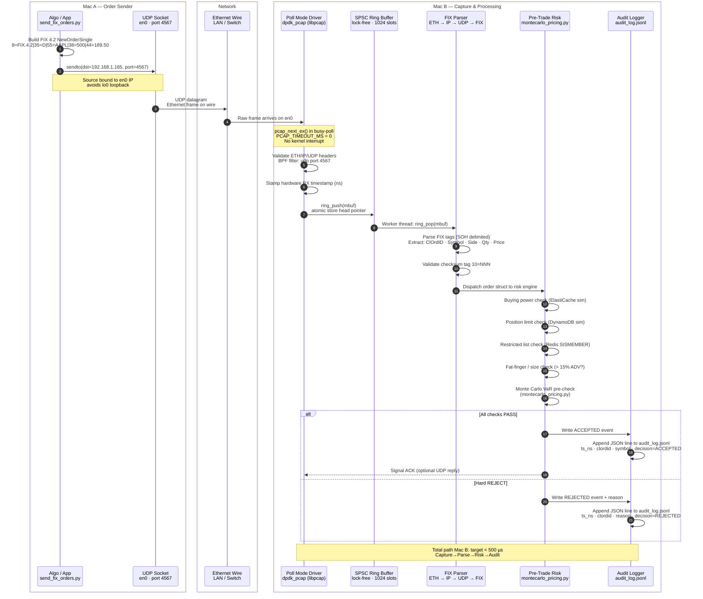

# Low-Latency FIX Order Pipeline — Mac-to-Mac with DPDK-style Capture

Two-machine pipeline: **Mac A** sends FIX 4.2 orders over UDP on `en0`.
**Mac B** captures every packet in kernel-bypass (DPDK-style) mode, parses
FIX, runs pre-trade risk, and writes an immutable audit log — all before the
kernel's TCP/IP stack is even involved.

---

## Network Topology

```
┌─────────────────────────┐          1 Gbps Ethernet          ┌────────────────────────────────┐
│       Mac A             │  ──────────────────────────────►  │          Mac B                 │
│  (Order Sender)         │    FIX/UDP  port 4567             │  (DPDK Capture + Risk Engine)  │
│  192.168.1.100          │    ~50–200 µs LAN RTT              │  192.168.1.165                 │
│  send_fix_orders.py     │                                    │  dpdk_pcap  (C / libpcap)      │
└─────────────────────────┘                                    └────────────────────────────────┘
```

---

## End-to-End Swimlane



---

## Component Swimlane — Mac B Internal


---

## Audit Log Format

Every order decision is appended to `audit_log.jsonl` (one JSON object per line).
The file is opened with `O_APPEND` — each `write()` call is atomic up to `PIPE_BUF`
(4 KB on macOS), so no locking is needed for single-writer use.

```jsonc
// ACCEPTED — NewOrderSingle
{
  "ts_ns":     1743980412837461200,   // RX hardware timestamp (nanoseconds)
  "wall_us":   1743980412837,         // wall-clock microseconds
  "seq":       42,                    // FIX MsgSeqNum (tag 34)
  "clordid":   "ORD000042",           // tag 11
  "sender":    "CLIENT",              // tag 49
  "symbol":    "AAPL",               // tag 55
  "side":      "Buy",                // tag 54 decoded
  "qty":       500,                  // tag 38
  "price":     189.50,               // tag 44
  "msg_type":  "D",                  // tag 35
  "decision":  "ACCEPTED",
  "risk_us":   187,                   // µs spent in risk checks
  "checks": {
    "buying_power": "PASS",
    "position_limit": "PASS",
    "restricted_list": "PASS",
    "fat_finger": "PASS",
    "var_precheck": "PASS"
  }
}

// REJECTED — fat finger
{
  "ts_ns":     1743980413102884600,
  "seq":       45,
  "clordid":   "ORD000045",
  "symbol":    "NVDA",
  "side":      "Buy",
  "qty":       950000,
  "price":     890.00,
  "msg_type":  "D",
  "decision":  "REJECTED",
  "reason":    "fat_finger: qty 950000 > 15% ADV (63000)",
  "risk_us":   43
}
```

---

## File Map

| File | Machine | Role |
|---|---|---|
| [send_fix_orders.py](send_fix_orders.py) | Mac A | Builds & sends FIX 4.2 NewOrderSingle / CancelRequest over UDP |
| [dpdk_pcap.c](dpdk_pcap.c) | Mac B | Kernel-bypass capture loop: mbuf pool, SPSC ring, BPF, FIX detection |
| [dpdk_sim.py](dpdk_sim.py) | Mac B | Pure-Python DPDK simulation (mempool, ring, PMD, pipeline) |
| [montecarlo_pricing.py](montecarlo_pricing.py) | Mac B | Pre-trade risk: MC VaR, Greeks, Heston, Almgren-Chriss |
| [rdma_transport.py](rdma_transport.py) | Both | RDMA zero-copy buffer transfer (EFA/IB or shared-mem sim) |
| [pre-trade-swimlane.md](pre-trade-swimlane.md) | — | Mermaid swimlane diagrams: OMS → Pricing → Risk → Audit |

---

## Quick Start

### Mac A — Send Orders

```bash
# Auto-detects en0 IP; sends 50 orders at 10/sec
python send_fix_orders.py --count 50 --rate 10 --verbose

# Send to explicit IP at max rate
python send_fix_orders.py --dst 192.168.1.165 --count 1000 --rate 0
```

### Mac B — Capture & Process

```bash
# 1. Build the DPDK-style capture binary
clang -O2 -Wall dpdk_pcap.c -lpcap -o dpdk_pcap

# 2. Run live capture on en0 (needs sudo for libpcap)
sudo ./dpdk_pcap en0

# 3. Or replay a saved pcap offline (no sudo needed)
./dpdk_pcap --offline test.pcap
```

### Mac B — Python DPDK Simulation (no sudo)

```bash
pip install -r requirements.txt

# Runs the full pipeline simulation: PMD → Ring → Parser → Risk → Stats
python dpdk_sim.py
```

### Latency Benchmark (RDMA simulation)

```bash
python rdma_transport.py --mode bench --iters 50000
```

---

## Latency Budget (target)

| Stage | Target | Notes |
|---|---|---|
| UDP send → wire | < 10 µs | Kernel UDP + en0 TX |
| Wire (LAN) | < 200 µs | 1 Gbps switch |
| pcap capture → mbuf | < 5 µs | Busy-poll, no interrupt |
| SPSC ring enqueue | < 1 µs | Atomic store, no lock |
| FIX parse (SOH scan) | < 10 µs | Linear scan, ~200 B msg |
| Risk checks (all 5) | < 200 µs | Cached data, no DB calls |
| MC VaR pre-check | < 500 µs | 10k paths, numpy |
| Audit log write | < 50 µs | O_APPEND atomic write |
| **Total Mac B** | **< 1 ms** | |

---

## Key Design Decisions

**Why UDP, not TCP for FIX?**
Eliminates TCP retransmit jitter. In a real exchange co-location the link
is lossless; retransmits are handled by FIX sequence number gap detection
at the application layer.

**Why busy-poll (`PCAP_TIMEOUT_MS = 0`)?**
Interrupt-driven capture adds 10–100 µs of kernel scheduling jitter.
Busy-polling keeps the core dedicated — identical to DPDK's Poll Mode Driver.

**Why SPSC ring between capture and parser?**
Single-Producer Single-Consumer avoids any mutex. The capture thread pushes;
the risk worker pops. Cache-line aligned mbuf structs prevent false sharing.

**Why `O_APPEND` for the audit log?**
POSIX guarantees `write()` with `O_APPEND` is atomic up to `PIPE_BUF`
(4 096 B on macOS). Each JSON audit line fits comfortably; no log rotation
lock is needed for a single-writer process.

**RDMA path (EFA / InfiniBand)**
On AWS `c5n` / `hpc6a` instances replace libpcap with EFA PMD and use
`rdma_transport.py` to push MC results from the pricing node to the risk
node with < 2 µs one-sided RDMA_WRITE latency — no remote CPU involved.
