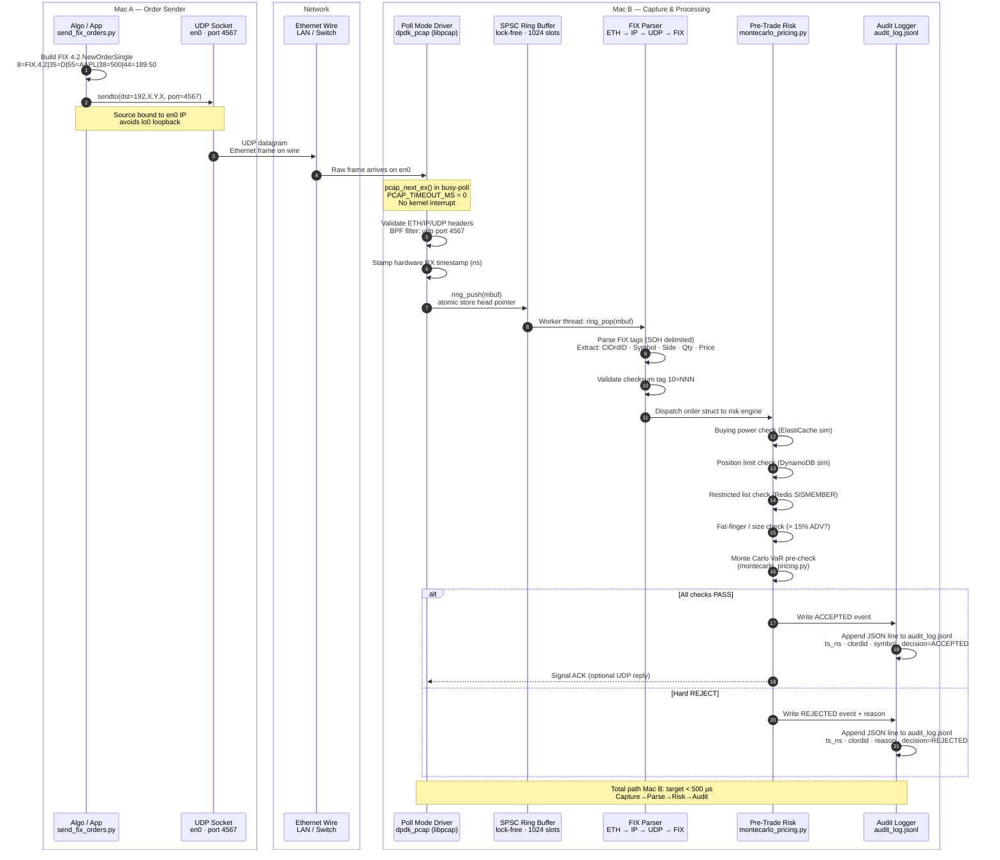

# Low-Latency FIX Order Pipeline — DPDK & RDMA Concepts on macOS

## Purpose and Scope

This repository is a **learning and concept-demonstration environment** for
two of the core technologies used in ultra-low-latency trading infrastructure:

- **DPDK (Data Plane Development Kit)** — kernel-bypass packet processing;
  poll-mode drivers, mbuf pools, lock-free rings, burst I/O
- **RDMA (Remote Direct Memory Access)** — zero-copy, CPU-bypass memory
  transfer between machines over InfiniBand or RoCE/EFA

All code here runs on two macOS laptops connected over a standard LAN.
It faithfully implements the *architecture and data structures* of production
systems — mbuf pool, SPSC ring, BPF filter, FIX parser, pre-trade risk,
protobuf market-data feed, RDMA shared-memory simulation — so you can
understand and test the full pipeline before deploying to real hardware.

> **This is not production kernel bypass.**
> On macOS, packets still flow through the kernel (libpcap/BPF on the receive
> side, BSD UDP socket on the send side). The code teaches the patterns;
> real bypass needs the hardware and OS described below.

---

## What Real Kernel Bypass Requires

True kernel bypass — where userspace code talks directly to the NIC with
**zero syscalls and zero kernel copies** — requires three things to align:

### 1. The Right OS — Linux only

DPDK's Poll Mode Drivers (PMDs) and RDMA verbs both require Linux.
macOS has no VFIO, no UIO, and no `/dev/infiniband`. BSD sockets are the
floor; there is no lower level accessible to userspace on macOS.

### 2. The Right NIC

| NIC / Fabric | Driver | Kernel bypass mechanism |
|---|---|---|
| Mellanox/NVIDIA ConnectX-5/6 (InfiniBand or RoCE) | `mlx5` PMD | DPDK VFIO — PMD polls NIC TX/RX descriptor rings |
| AWS EFA (Elastic Fabric Adapter) | `librte_net_efa` PMD | EFA PMD on EC2; also exposes RDMA verbs via `libfabric` |
| Solarflare XtremeScale | `ef10` PMD / OpenOnload | Kernel-bypass UDP via `ef_vi` API |
| Intel E810 / X710 | `ice` / `i40e` PMD | DPDK VFIO |
| Chelsio T6 | `cxgbe` PMD | DPDK VFIO + iWARP RDMA |

### 3. The Right Software Stack

```
Production kernel-bypass stack
───────────────────────────────────────────────────────────────────
 Application (FIX engine / market data handler)
      │
 DPDK rte_eth_rx_burst / rte_eth_tx_burst      ← zero syscall
      │
 Poll Mode Driver (PMD)                         ← polls NIC registers
      │
 NIC hardware (DMA into hugepage-backed mbufs)  ← zero kernel copy
      │
 Wire (IB / RoCE / 10/25/100 GbE)
───────────────────────────────────────────────────────────────────
 RDMA one-sided write (rdma_transport.py → libibverbs)
      │
 HCA (Host Channel Adapter) hardware            ← remote CPU never wakes
      │
 Wire
```

Key requirements:
- **Hugepages** — DPDK mbufs must live in 2 MB / 1 GB hugepages (`/dev/hugepages`)
- **VFIO or UIO** — detaches the NIC from the kernel driver so the PMD owns it
- **CPU isolation** — dedicated cores for RX/TX loops (`isolcpus`, `DPDK_lcores`)
- **NUMA awareness** — mbufs allocated on the same NUMA node as the NIC

### Mapping this Repo to Production

| This repo (macOS) | Production equivalent |
|---|---|
| `libpcap` + BPF capture | `rte_eth_rx_burst()` polling NIC RX ring |
| `socket.sendto()` (Python) | `rte_eth_tx_burst()` or `ef_vi_transmit()` |
| Anonymous `mmap` buffer | Hugepage-backed `rte_mempool` |
| Shared-memory RDMA sim | `libibverbs` RC QP RDMA_WRITE over EFA/IB |
| `PCAP_TIMEOUT_MS=0` busy-poll | DPDK `rte_eth_rx_burst` tight loop, no IRQ |
| SPSC ring (atomic head/tail) | `rte_ring` (same algorithm, same cache-line trick) |

The gap is the hardware abstraction layer. Every concept, data structure, and
pipeline stage in this repo maps directly to its production counterpart.

---

## This Repo — Two Macs, LAN

Two-machine pipeline: **Mac A** sends FIX 4.2 orders and protobuf market-data
over UDP on `en0`. **Mac B** captures every packet using a DPDK-style
architecture (mbuf pool, SPSC ring, busy-poll) backed by libpcap/BPF,
parses FIX and market-data, runs pre-trade risk, and writes an immutable
audit log.

---

## Network Topology

```
┌─────────────────────────────┐       1 Gbps Ethernet        ┌──────────────────────────────────────┐
│          Mac A              │  ──────────────────────────► │             Mac B                    │
│  (Order + MktData Sender)   │  FIX/UDP   port 4567         │  (DPDK-style Capture · libpcap/BPF)  │
│  192.168.1.100              │  Proto/UDP port 5678         │  192.X.Y.X                       │
│  send_fix_orders.py         │  ~50–200 µs LAN RTT          │  dpdk_pcap  (C · libpcap)            │
│  send_market_data.py        │                              │  dpdk_sim.py (Python simulation)     │
└─────────────────────────────┘                              └──────────────────────────────────────┘
```

### Kernel Bypass — Reality vs Production

| Transport | Platform | Kernel involved? | Typical latency |
|---|---|---|---|
| **libpcap/BPF** (this repo, macOS) | macOS | Yes — BPF copy through kernel | 10–100 µs |
| **AF_PACKET** (`SOCK_RAW`) | Linux | Yes — kernel copies to userspace | 5–50 µs |
| **AF_XDP + XDP_ZEROCOPY** | Linux ≥ 5.4 | Near-bypass — DMA into userspace ring | 1–10 µs |
| **DPDK + VFIO/UIO PMD** | Linux | No — PMD polls NIC registers directly | < 2 µs |
| **AWS EFA + DPDK** (`librte_net_efa`) | EC2 c5n/p4d/hpc6a | No — EFA PMD, kernel bypass | < 2 µs |
| **RDMA one-sided write** (`rdma_transport.py`) | Linux + EFA/IB | No — remote CPU never involved | < 1 µs |

On macOS the BPF subsystem still delivers sub-millisecond capture latency for
development and testing, which is sufficient for validating the pipeline logic.
Deploy to a Linux EC2 instance with EFA for production kernel-bypass numbers.

---

## How to Run — Step by Step

### Prerequisites (both Macs)

```bash
# Clone / copy this repo to both machines
git clone <repo> ~/aws/low_latency && cd ~/aws/low_latency

# Python venv
python3 -m venv .venv && source .venv/bin/activate
pip install -r requirements.txt

# Optional: compile proto stubs for full protobuf encoding
pip install grpcio-tools
python -m grpc_tools.protoc -I. --python_out=client/ client/market_data.proto
```

---

### Mac B — Start First (Receiver + DPDK Capture)

Mac B must be listening before Mac A sends anything.

**Terminal 1 — Build and start the DPDK-style packet capture**

```bash
# Build (one-time)
make build   # or: clang -O2 -Wall ems/dpdk_pcap.c -lpcap -o ems/dpdk_pcap

# Live capture on en0 — intercepts both FIX (port 4567) and market data (port 5678)
sudo ./ems/dpdk_pcap en0
```

Expected output:
```
═══════════════════════════════════════════════
  DPDK-Style Packet Processor — libpcap/macOS
═══════════════════════════════════════════════
[mempool] allocated 4096 mbufs
[ring]    1024-slot SPSC ring ready
[pcap]    filter: udp port 4567 or udp port 5678
Waiting for packets on en0 …
```

**Terminal 2 — Optional: Python DPDK simulation (no sudo, software only)**

```bash
# Runs the full pipeline in Python: PMD → Ring → Parser → Risk → Stats
source .venv/bin/activate
python ems/dpdk_sim.py
```

**Terminal 3 — Optional: market-data decoder (verify proto decoding)**

```bash
source .venv/bin/activate
python client/send_market_data.py --mode decode --port 5678
```

---

### Mac A — Send FIX Orders and Market Data

Replace `192.X.Y.X` with Mac B's actual `en0` IP (`ipconfig getifaddr en0` on Mac B).

---

**Terminal 1 — Trader UI (recommended — replaces send_fix_orders.py)**

The interactive terminal UI supports two modes switchable with `Tab`:

- **Manual mode** — fill in Symbol / Side / Qty / Price / OrdType, hit `F9` to send one order
- **Algo mode** — configure rate, count, symbol universe; `F9` starts the burst, `F10` stops it

```bash
source .venv/bin/activate

# Start in Manual mode, auto-detect en0 IP
python client/trader_ui.py

# Start in Manual mode, explicit EMS address
python client/trader_ui.py --dst 192.X.Y.X

# Start directly in Algo mode
python client/trader_ui.py --dst 192.X.Y.X --mode algo
```

Key bindings inside the TUI:

| Key | Action |
|---|---|
| `Tab` / `t` | Toggle Manual ↔ Algo mode |
| `F9` | Submit order (Manual) / Start algo (Algo) |
| `F10` | Stop algo |
| `Ctrl+C` | Send FIX CancelRequest for highlighted blotter row |
| `Ctrl+Q` | Quit |

---

**Terminal 2 — GBO Reference Data (load before running risk checks)**

`gbo_ref_data.py` is the firm's golden source for instrument master, counterparty
limits, account limits, FX rates, and holiday calendars.  Run it standalone to
seed the in-memory store and validate all pre-trade and post-trade risk checks:

```bash
source .venv/bin/activate

# Full demo: loads all ref data, runs pre-trade checks on sample orders,
# books fills, prints position report and post-trade violations
python gbo_ref_data.py
```

What the demo prints:
- Instrument master (ISIN, CUSIP, tick size, lot size, currency)
- Counterparty / account / limit tables
- Pre-trade risk results for 5 sample orders (PASS / WARN / BLOCK per check)
- Post-trade position report with P&L, gross/net exposure, VaR
- Any post-trade limit breaches with severity

The `GBORefDataStore` class is imported by `pre_trade_risk/montecarlo_pricing.py`
and the post-trade surveillance engine.  Always start GBO before the risk engines:

```python
from gbo_ref_data import GBORefDataStore, PreTradeRiskEngine

gbo    = GBORefDataStore()
engine = PreTradeRiskEngine(gbo)
result = engine.check(order)
```

---

**Terminal 3 — Send market data feed (NBBO / Trade / L2 Book)**

```bash
source .venv/bin/activate

# Mixed feed: NBBO + Trade + Heartbeat at 10 msg/s
python client/send_market_data.py --dst 192.X.Y.X

# NBBO only at 1000 msg/s
python client/send_market_data.py --dst 192.X.Y.X --type nbbo --rate 1000 --count 5000

# L2 book snapshots, 10 levels deep
python client/send_market_data.py --dst 192.X.Y.X --type book --depth 10 --count 200

# Incremental book deltas
python client/send_market_data.py --dst 192.X.Y.X --type delta --count 1000 --rate 500
```

---

**Terminal 4 — Script-based FIX sender (headless / CI)**

```bash
source .venv/bin/activate

# 500 orders at 50/sec
python client/send_fix_orders.py --dst 192.X.Y.X --count 500 --rate 50 --verbose

# Max rate stress test
python client/send_fix_orders.py --dst 192.X.Y.X --count 10000 --rate 0
```

---

**Terminal 5 — RDMA latency benchmark**

```bash
source .venv/bin/activate
python ems/rdma_transport.py --mode bench --iters 50000
```

---

### Audit Log (Mac B)

`dpdk_pcap` appends every FIX decision to `post_trade/surveillance/fix_audit.log`.

```bash
# Live tail on Mac B
tail -f post_trade/surveillance/fix_audit.log | python -m json.tool

# Count accepted vs rejected
grep -c '"decision": "ACCEPTED"' post_trade/surveillance/fix_audit.log
grep -c '"decision": "REJECTED"' post_trade/surveillance/fix_audit.log
```

---

### Typical Terminal Layout

```
Mac A                                    Mac B
──────────────────────────────────────   ────────────────────────────────────────
Terminal 1  (Trader UI — interactive):   Terminal 1  (EMS capture):
  python client/trader_ui.py        ──►    sudo ./ems/dpdk_pcap en0
    [Manual or Algo mode toggle]             [FIX lines in green]
    [live order blotter]                     [MKTDATA lines in cyan]

Terminal 2  (GBO ref data):              Terminal 2  (Audit log tail):
  python gbo_ref_data.py            ──►    tail -f post_trade/surveillance/fix_audit.log

Terminal 3  (Market data feed):          Terminal 3  (Python DPDK sim, optional):
  python client/send_market_data.py ──►    python ems/dpdk_sim.py
```

---

## End-to-End Swimlane



---

## Component Swimlane — Mac B Internal

```mermaid
flowchart TD
    subgraph NIC["NIC — en0 (libpcap / DPDK PMD)"]
        N1[pcap_next_ex\nbusy-poll loop] --> N2[BPF filter\nudp port 4567]
        N2 --> N3[mbuf_alloc\nfrom pool]
        N3 --> N4[Copy frame\nto mbuf data region]
        N4 --> N5[Stamp\nRX timestamp ns]
    end

    subgraph RING["SPSC Ring Buffer  1024 slots"]
        R1[ring_push\natomic store head] --> R2[(Circular mbuf\npointer array)]
        R2 --> R3[ring_pop\natomic load tail]
    end

    subgraph PARSE["FIX Parser"]
        P1[Peel ETH header\n14 bytes] --> P2[Peel IP header\n20 bytes]
        P2 --> P3[Peel UDP header\n8 bytes]
        P3 --> P4[Scan SOH-delimited\ntag=value pairs]
        P4 --> P5{tag 35?}
        P5 -->|D NewOrderSingle| P6[Extract fields\n11 49 55 54 38 44]
        P5 -->|F CancelRequest| P7[Extract fields\n11 41 55]
        P6 & P7 --> P8[Verify checksum\ntag 10]
    end

    subgraph RISK["Pre-Trade Risk  montecarlo_pricing.py"]
        K1[Buying Power\ncheck] --> K2{Pass?}
        K2 -->|No| KX([Hard Reject])
        K2 -->|Yes| K3[Position Limits]
        K3 --> K4{Pass?}
        K4 -->|No| KX
        K4 -->|Yes| K5[Restricted List\nSISMEMBER]
        K5 --> K6[Fat Finger\nsize vs ADV]
        K6 --> K7[MC VaR\npre-check]
        K7 --> K8{All Pass?}
        K8 -->|Yes| KA([ACCEPTED])
        K8 -->|No| KX
    end

    subgraph AUDIT["Audit Logger — audit_log.jsonl"]
        A1[Serialise to JSON\nts_ns · seq · fields] --> A2[os.write\nO_APPEND atomic]
        A2 --> A3[(audit_log.jsonl\nappend-only file)]
        A3 --> A4[(Rotate daily\ngzip + SHA-256)]
    end

    N5 --> R1
    R3 --> P1
    P8 --> K1
    KA --> A1
    KX --> A1

    style NIC   fill:#0d1a37,stroke:#4a7fff,color:#c0d8ff
    style RING  fill:#0d3720,stroke:#4aff8a,color:#c0ffd8
    style PARSE fill:#37200d,stroke:#ffaa4a,color:#ffe0c0
    style RISK  fill:#3a1a1a,stroke:#ff4a4a,color:#ffe0e0
    style AUDIT fill:#1a0d37,stroke:#aa4aff,color:#e0c0ff
```



---

## Audit Log Format

Every order decision is appended to `audit_log.jsonl` (one JSON object per line).
The file is opened with `O_APPEND` — each `write()` call is atomic up to `PIPE_BUF`
(4 KB on macOS), so no locking is needed for single-writer use.

```jsonc
// ACCEPTED — NewOrderSingle
{
  "ts_ns":     1743980412837461200,   // RX hardware timestamp (nanoseconds)
  "wall_us":   1743980412837,         // wall-clock microseconds
  "seq":       42,                    // FIX MsgSeqNum (tag 34)
  "clordid":   "ORD000042",           // tag 11
  "sender":    "CLIENT",              // tag 49
  "symbol":    "AAPL",               // tag 55
  "side":      "Buy",                // tag 54 decoded
  "qty":       500,                  // tag 38
  "price":     189.50,               // tag 44
  "msg_type":  "D",                  // tag 35
  "decision":  "ACCEPTED",
  "risk_us":   187,                   // µs spent in risk checks
  "checks": {
    "buying_power": "PASS",
    "position_limit": "PASS",
    "restricted_list": "PASS",
    "fat_finger": "PASS",
    "var_precheck": "PASS"
  }
}

// REJECTED — fat finger
{
  "ts_ns":     1743980413102884600,
  "seq":       45,
  "clordid":   "ORD000045",
  "symbol":    "NVDA",
  "side":      "Buy",
  "qty":       950000,
  "price":     890.00,
  "msg_type":  "D",
  "decision":  "REJECTED",
  "reason":    "fat_finger: qty 950000 > 15% ADV (63000)",
  "risk_us":   43
}
```

---

## Folder Structure

```
low_latency/
├── gbo_ref_data.py                  GBO golden source: instrument/counterparty/limit/FX ref data
│
├── client/                          Mac A — order and market data senders
│   ├── trader_ui.py                 Textual TUI: Manual order entry + Algo burst mode
│   ├── send_fix_orders.py           FIX 4.2 NewOrderSingle / CancelRequest over UDP (headless)
│   ├── send_market_data.py          Protobuf NBBO / Trade / L2 Book feed over UDP
│   ├── market_data.proto            Protobuf schema for all market-data message types
│   └── market_data_pb2.py           Generated Python stubs (grpc_tools.protoc)
│
├── oms/                             Order Management System  [to implement]
│   └── README.md
│
├── pre_trade_risk/                  Pre-Trade Risk Engine
│   ├── montecarlo_pricing.py        MC VaR, Greeks, Heston, Almgren-Chriss
│   ├── pre-trade-swimlane.md        Mermaid swimlanes: OMS → Pricing → Risk → Audit
│   └── pre-trade-deep-dive.md       Every risk check explained
│
├── sor/                             Smart Order Router  [to implement]
│   └── README.md
│
├── ems/                             Execution Management System — Mac B
│   ├── dpdk_pcap.c                  libpcap capture: mbuf pool, SPSC ring, BPF
│   ├── dpdk_sim.py                  Pure-Python DPDK simulation (no sudo)
│   ├── rdma_transport.py            RDMA zero-copy transfer (EFA/IB or shared-mem sim)
│   ├── dpdk_sequence.drawio         DPDK pipeline sequence diagram
│   └── test.pcap                    Sample capture for offline replay
│
└── post_trade/
    ├── clearance/                   CCP novation, margin, netting  [to implement]
    │   └── README.md
    ├── settlement/                  DvP, T+1, reconciliation  [to implement]
    │   └── README.md
    └── surveillance/                Audit trail, market abuse detection
        ├── README.md
        └── fix_audit.log            Live NDJSON audit log written by ems/dpdk_pcap
```

## File Map

| File | Lifecycle Stage | Role |
|---|---|---|
| [gbo_ref_data.py](gbo_ref_data.py) | Shared | GBO golden source: instrument master, counterparty, limits, FX rates |
| [client/trader_ui.py](client/trader_ui.py) | Client | Textual TUI — Manual order entry + Algo burst mode, live blotter |
| [client/send_fix_orders.py](client/send_fix_orders.py) | Client | Headless FIX 4.2 sender — CI / stress testing |
| [client/send_market_data.py](client/send_market_data.py) | Client | Protobuf NBBO / Trade / L2 Book feed over UDP |
| [client/market_data.proto](client/market_data.proto) | Client | Protobuf schema: 7 market-data message types |
| [oms/README.md](oms/README.md) | OMS | State machine, FIX session, persistence spec |
| [pre_trade_risk/montecarlo_pricing.py](pre_trade_risk/montecarlo_pricing.py) | Pre-Trade Risk | MC VaR, Greeks, Heston, Almgren-Chriss |
| [pre_trade_risk/pre-trade-swimlane.md](pre_trade_risk/pre-trade-swimlane.md) | Pre-Trade Risk | Mermaid swimlane diagrams |
| [sor/README.md](sor/README.md) | SOR | Venue ranking, algo selection spec |
| [ems/dpdk_pcap.c](ems/dpdk_pcap.c) | EMS | libpcap capture: mbuf pool, SPSC ring, FIX + proto parser |
| [ems/dpdk_sim.py](ems/dpdk_sim.py) | EMS | Pure-Python DPDK simulation |
| [ems/rdma_transport.py](ems/rdma_transport.py) | EMS | RDMA zero-copy transfer (EFA/IB or shared-mem sim) |
| [post_trade/surveillance/fix_audit.log](post_trade/surveillance/fix_audit.log) | Surveillance | Immutable NDJSON audit log |
| [post_trade/clearance/README.md](post_trade/clearance/README.md) | Clearance | CCP novation, margin, netting spec |
| [post_trade/settlement/README.md](post_trade/settlement/README.md) | Settlement | DvP, T+1, reconciliation spec |

---

## Quick Start

### Mac A — Send Orders

```bash
# Auto-detects en0 IP; sends 50 orders at 10/sec
python client/send_fix_orders.py --count 50 --rate 10 --verbose

# Send to explicit IP at max rate
python client/send_fix_orders.py --dst 192.X.Y.X --count 1000 --rate 0
```

### Mac B — Capture & Process

```bash
# 1. Build the DPDK-style capture binary
make build   # or: clang -O2 -Wall ems/dpdk_pcap.c -lpcap -o ems/dpdk_pcap

# 2. Run live capture on en0 (needs sudo for libpcap)
sudo ./ems/dpdk_pcap en0

# 3. Or replay a saved pcap offline (no sudo needed)
./ems/dpdk_pcap --offline ems/test.pcap
```

### Mac B — Python DPDK Simulation (no sudo)

```bash
pip install -r requirements.txt

# Runs the full pipeline simulation: PMD → Ring → Parser → Risk → Stats
python ems/dpdk_sim.py
```

### Latency Benchmark (RDMA simulation)

```bash
python ems/rdma_transport.py --mode bench --iters 50000
```

---

## Latency Budget (target)

| Stage | Target | Notes |
|---|---|---|
| UDP send → wire | < 10 µs | Kernel UDP + en0 TX |
| Wire (LAN) | < 200 µs | 1 Gbps switch |
| pcap capture → mbuf | < 5 µs | Busy-poll, no interrupt |
| SPSC ring enqueue | < 1 µs | Atomic store, no lock |
| FIX parse (SOH scan) | < 10 µs | Linear scan, ~200 B msg |
| Risk checks (all 5) | < 200 µs | Cached data, no DB calls |
| MC VaR pre-check | < 500 µs | 10k paths, numpy |
| Audit log write | < 50 µs | O_APPEND atomic write |
| **Total Mac B** | **< 1 ms** | |

---

## Key Design Decisions

**Why UDP, not TCP for FIX?**
Eliminates TCP retransmit jitter. In a real exchange co-location the link
is lossless; retransmits are handled by FIX sequence number gap detection
at the application layer.

**Why busy-poll (`PCAP_TIMEOUT_MS = 0`)?**
Interrupt-driven capture adds 10–100 µs of kernel scheduling jitter.
Busy-polling keeps the core dedicated — identical to DPDK's Poll Mode Driver.

**Why SPSC ring between capture and parser?**
Single-Producer Single-Consumer avoids any mutex. The capture thread pushes;
the risk worker pops. Cache-line aligned mbuf structs prevent false sharing.

**Why `O_APPEND` for the audit log?**
POSIX guarantees `write()` with `O_APPEND` is atomic up to `PIPE_BUF`
(4 096 B on macOS). Each JSON audit line fits comfortably; no log rotation
lock is needed for a single-writer process.

**RDMA path (EFA / InfiniBand)**
On AWS `c5n` / `hpc6a` instances replace libpcap with EFA PMD and use
`rdma_transport.py` to push MC results from the pricing node to the risk
node with < 2 µs one-sided RDMA_WRITE latency — no remote CPU involved.
