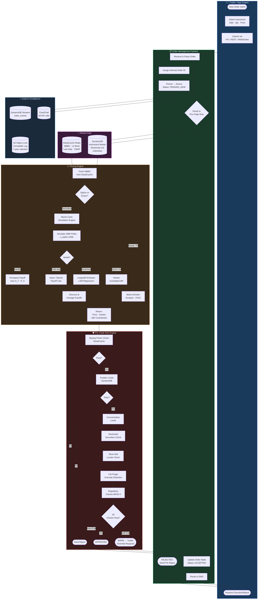
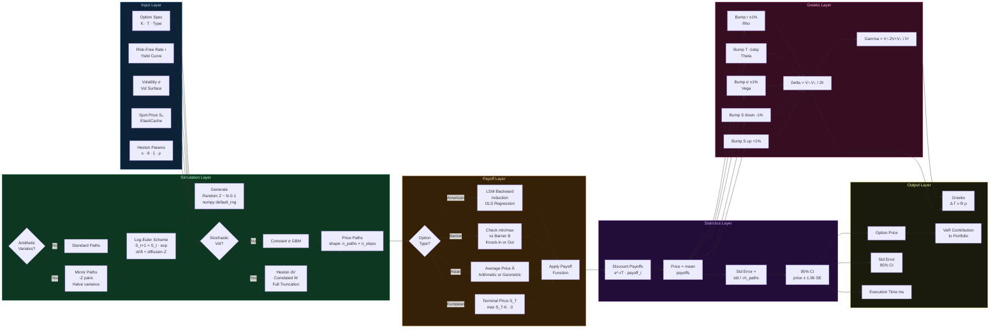
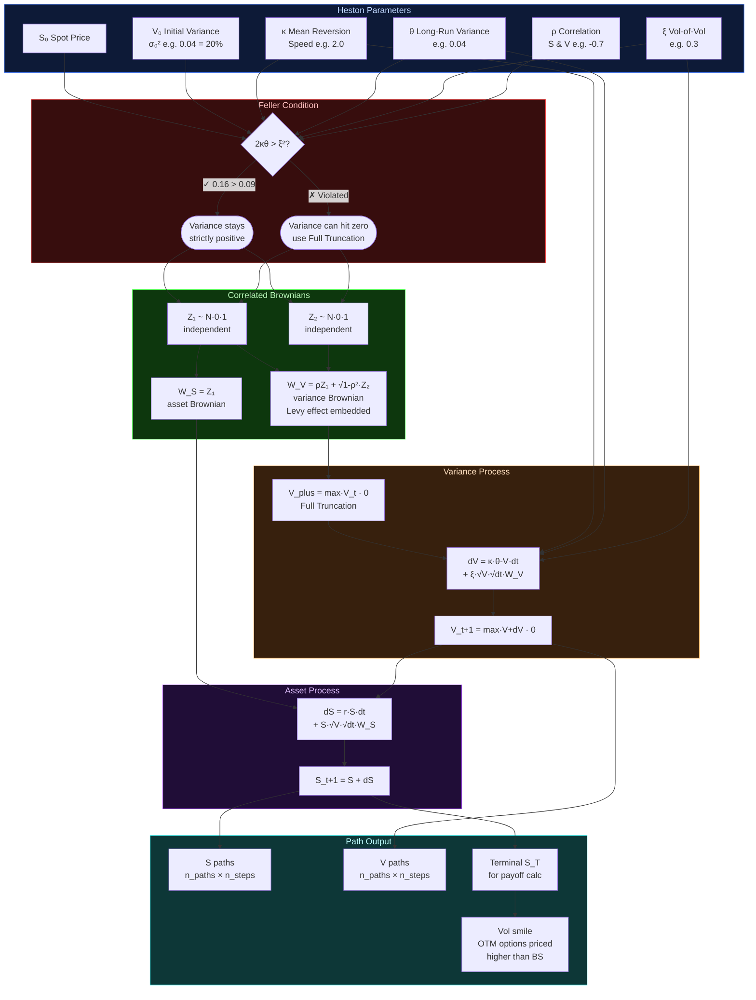

# Pre-Trade — Mermaid Swimlane Diagrams

---

## 1. Pre-Trade End-to-End Swimlane

---

## 2. Monte Carlo Engine — Internal Swimlane

---

## 3. Pre-Trade Risk Check Swimlane (Decision Flow)

```mermaid
flowchart TD
    subgraph SUBMIT["Order Submission"]
        S1([Trader Submits\nNew Order]) --> S2[FIX / REST Gateway]
        S2 --> S3[OMS validates\nfields & sessions]
    end

    subgraph CHECK1["Check 1 · Buying Power"]
        C1A[Fetch cash balance\nElastiCache] --> C1B{Notional ≤\nAvailable Cash?}
        C1B -->|✗ No| C1C([Hard Reject\nInsufficient funds])
        C1B -->|✓ Yes| C1D([Pass →])
    end

    subgraph CHECK2["Check 2 · Position Limits"]
        C2A[Project position\ncurrent + pending + order] --> C2B{Within\nMax Long/Short?}
        C2B -->|✗ No| C2C([Hard Reject\nLimit breached])
        C2B -->|✓ Yes| C2D([Pass →])
    end

    subgraph CHECK3["Check 3 · Order Size"]
        C3A[Check vs ADV\nMax notional\nLot size] --> C3B{Size OK?}
        C3B -->|✗ > 15% ADV| C3C([Soft Reject\nFat finger warn])
        C3B -->|✓ Yes| C3D([Pass →])
    end

    subgraph CHECK4["Check 4 · Restricted List"]
        C4A[SISMEMBER\nElastiCache SET\nOFAC · Halt · Watch] --> C4B{On any\nRestricted List?}
        C4B -->|✗ Yes| C4C([Hard Reject\nRestricted security])
        C4B -->|✓ No| C4D([Pass →])
    end

    subgraph CHECK5["Check 5 · Short-Sell"]
        C5A{Is Short\nSell?} --> |No| C5E([Pass →])
        C5A --> |Yes| C5B[Check SSR list\nLocate availability]
        C5B --> C5C{Locate ≥\nShort Qty?}
        C5C -->|✗ No| C5D([Hard Reject\nNo locate])
        C5C -->|✓ Yes| C5E
    end

    subgraph CHECK6["Check 6 · Regulatory"]
        C6A[MiFID II venue check\nPDT rule\nWash trade scan] --> C6B{Compliant?}
        C6B -->|✗ No| C6C([Hard Reject\nRegulatory breach])
        C6B -->|✓ Yes| C6D([Pass →])
    end

    subgraph CHECK7["Check 7 · VaR Pre-Check"]
        C7A[Monte Carlo\nMarginal VaR calc] --> C7B{Portfolio VaR\n≤ Limit?}
        C7B -->|✗ No| C7C([Soft Reject\nVaR limit warn])
        C7B -->|✓ Yes| C7D([Pass →])
    end

    subgraph DECISION["Final Decision"]
        D1{All Checks\nPassed?}
        D1 -->|✓ Yes| D2([APPROVED\nRoute to EMS])
        D1 -->|Soft| D3([WARN to Trader\nAwait Override])
        D1 -->|Hard| D4([REJECTED\nFIX ExecutionReport\nOrdStatus=8])
    end

    subgraph AUDIT2["Audit Trail"]
        AU1[(DynamoDB\norder_events)] 
        AU2[(S3 Object Lock)]
        AU1 --> AU2
    end

    S3 --> C1A
    C1D --> C2A
    C2D --> C3A
    C3D --> C4A
    C4D --> C5A
    C5E --> C6A
    C6D --> C7A
    C7D --> D1
    C1C & C2C & C3C & C4C & C5D & C6C & C7C --> D1
    D2 & D3 & D4 --> AU1

    style SUBMIT  fill:#0d1a2e,stroke:#2e6eb5,color:#a8c8ff
    style CHECK1  fill:#0d2e1a,stroke:#2eb56e,color:#a8ffc8
    style CHECK2  fill:#2e1a0d,stroke:#b5832e,color:#ffd8a8
    style CHECK3  fill:#2e0d1a,stroke:#b52e83,color:#ffa8d8
    style CHECK4  fill:#1a0d2e,stroke:#832eb5,color:#d8a8ff
    style CHECK5  fill:#2e2e0d,stroke:#b5b52e,color:#ffffa8
    style CHECK6  fill:#0d2e2e,stroke:#2eb5b5,color:#a8ffff
    style CHECK7  fill:#1a2e0d,stroke:#6eb52e,color:#d8ffa8
    style DECISION fill:#1a0d0d,stroke:#b52e2e,color:#ffa8a8
    style AUDIT2  fill:#0d0d1a,stroke:#2e2eb5,color:#a8a8ff
```

---

## 4. Almgren-Chriss Execution Cost Swimlane

```mermaid
flowchart LR
    subgraph INPUTS["Trade Intent"]
        direction TB
        AI1[Total Shares X\n100,000]
        AI2[Horizon T\n5 days]
        AI3[Urgency Level\nLow · Med · High]
        AI4[Market Params\nσ · η · γ · ADV]
    end

    subgraph STRATEGY["Strategy Selection"]
        direction TB
        ST1{Urgency?}
        ST1 -->|Low| ST2[TWAP\nEqual slices\nX/N per interval]
        ST1 -->|Medium| ST3[IS Optimal\nFront-loaded\nsinh schedule]
        ST1 -->|High| ST4[Aggressive\nFOK / IOC sweeps]
        ST2 & ST3 & ST4 --> ST5[Execution Schedule\nt₁:q₁ · t₂:q₂ · ...]
    end

    subgraph IMPACT["Impact Simulation\n10,000 paths"]
        direction TB
        IM1[Per Interval\nRandom Price Move\nGBM step] --> IM2[Apply Temp Impact\nexec_px = mid + η·rate]
        IM2 --> IM3[Apply Perm Impact\nnext mid shifts by γ·x_i]
        IM3 --> IM4[Accumulate\nTotal Execution Cost]
        IM4 --> IM5[Impl Shortfall\ncost - X·S₀ benchmark]
    end

    subgraph STATS2["Cost Statistics"]
        direction TB
        CS1[Mean IS $]
        CS2[Std Dev $]
        CS3[IS in bps\nIS$ / X·S₀ × 10000]
        CS4[95th Pct Cost\nWorst-case estimate]
        CS1 --> CS3
    end

    subgraph COMPARE["Strategy Comparison"]
        direction TB
        CMP1[TWAP cost]
        CMP2[IS Optimal cost]
        CMP3[Risk-adjusted\nE·IS + λ·Var·IS]
        CMP1 & CMP2 --> CMP3
        CMP3 --> CMP4{Min cost\nstrategy?}
        CMP4 --> CMP5([Selected Strategy\n→ OMS / EMS])
    end

    AI1 & AI2 & AI3 & AI4 --> ST1
    ST5 --> IM1
    IM5 --> CS1 & CS2 & CS4
    CS1 --> CMP1
    CS1 --> CMP2
    CS3 --> CMP3

    style INPUTS   fill:#0d1a37,stroke:#1e4eb5,color:#a8c0ff
    style STRATEGY fill:#0d3720,stroke:#1eb550,color:#a8ffcc
    style IMPACT   fill:#371a0d,stroke:#b5501e,color:#ffc0a8
    style STATS2   fill:#1a0d37,stroke:#501eb5,color:#cca8ff
    style COMPARE  fill:#0d3737,stroke:#1eb5b5,color:#a8ffff
```

---

## 5. Heston Model Swimlane — Path Simulation

---

## Quick Reference — Swimlane Legend

| Swimlane | Colour | Responsibility |
|---|---|---|
| Trader / Algo Engine | Blue | Order intent, UI, FIX client |
| OMS | Green | Lifecycle, state machine, persistence |
| Market Data | Purple | NBBO, L2 book, reference data |
| Pricing Engine | Orange | MC simulation, BS, Greeks |
| Risk Engine | Red | 7-check synchronous gate |
| Audit / Compliance | Navy | Immutable trail, S3 WORM |
| MC Simulation | Teal | GBM paths, antithetic, Heston |
| Execution Cost | Mixed | Almgren-Chriss TWAP / IS Optimal |
